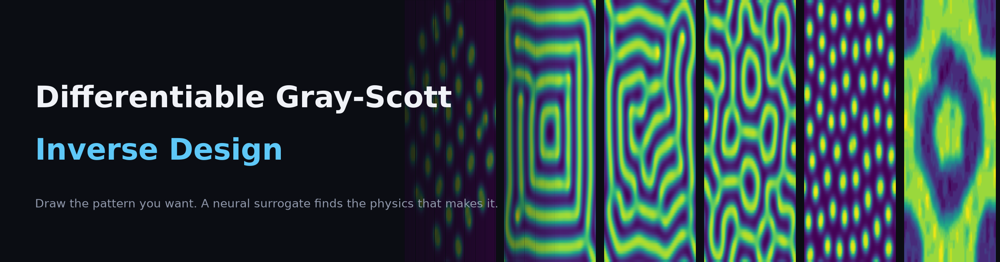
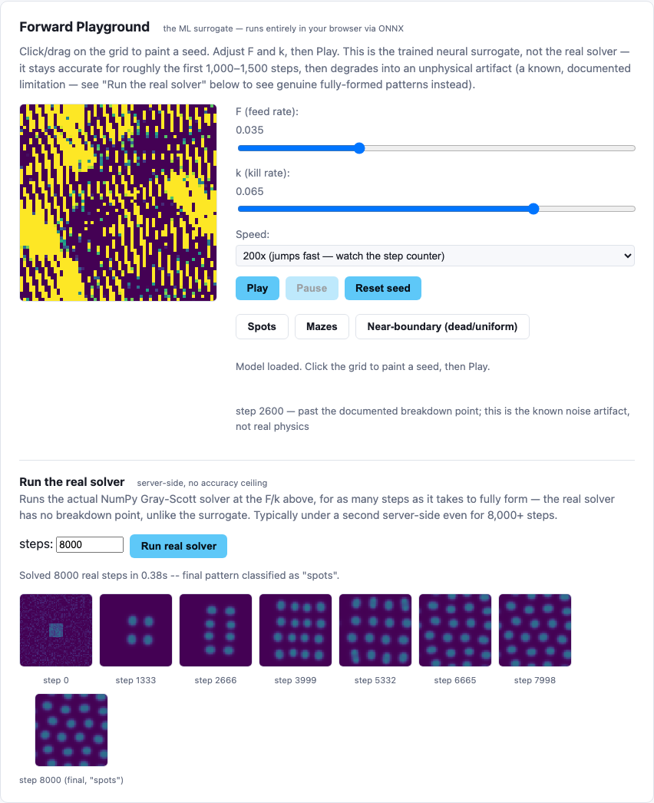
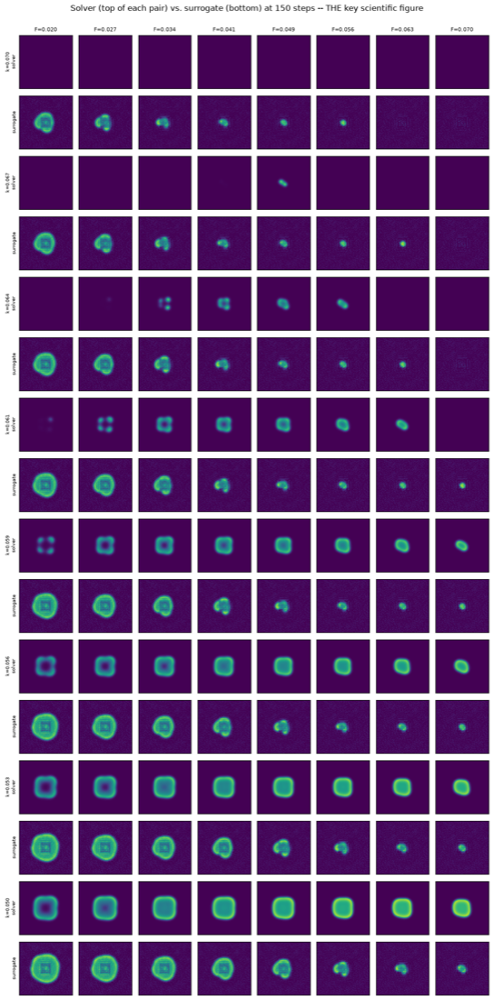
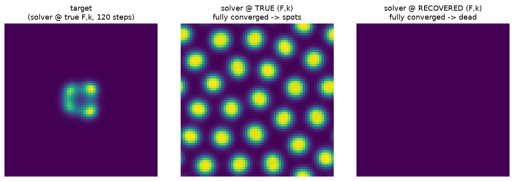

<div align="center">



# Differentiable Gray-Scott Inverse Design

**Draw the pattern you want. A neural surrogate finds the physics that makes it.**

[**🔗 Live demo**](https://akshay-coded.github.io/graydiff/) &nbsp;·&nbsp;
[Build notebooks](notebooks/) &nbsp;·&nbsp;
[Original spec](Inverse_Design_Differentiable_Surrogate_Spec.docx) &nbsp;·&nbsp;
[License: MIT](LICENSE)


</div>

> **Demo status:** the forward playground above is live and fully client-side. The "Solve for
> physics" / "Run the real solver" panels need the FastAPI backend, which isn't deployed yet
> (Hugging Face Spaces, in progress) — until then those calls will fail with a connection error.

---

## The idea, in one paragraph

Gray-Scott is a two-chemical reaction-diffusion system — the same class of math Alan Turing
proposed in 1952 for how a featureless embryo grows spots and stripes. Two numbers, feed rate
**F** and kill rate **k**, decide whether the result is spots, stripes, mazes, or nothing at all.
A classical numerical solver computes *forward* beautifully: given (F, k), what pattern emerges?
It cannot compute *backward*: given a pattern, what (F, k) produced it — because it has no
gradients to offer, only blind trial and error. This project trains a small convolutional network
to imitate the solver, then exploits the one thing the network has that the solver structurally
lacks — **differentiability** — to run the physics backwards: freeze the trained network, treat
F and k as the only two learnable parameters, and gradient-descend on them through a differentiable
rollout until the network's output matches a target pattern someone drew. Every recovered result
is then handed back to the *real* solver for independent verification — the surrogate never
grades its own homework.

The surrogate's speed is a side effect. The actual claim is that it has gradients and the solver
doesn't — a qualitative capability difference, not a quantitative one.

## Try it

| | |
|---|---|
| **Forward playground** | Paint a seed, set F/k, watch it evolve — runs entirely in your browser via [onnxruntime-web](https://github.com/microsoft/onnxruntime), no backend involved. |
| **Solve for physics** | Draw a target pattern; a small backend runs grid-search + gradient descent through the frozen surrogate and shows the recovered (F, k), the search trajectory on the phase diagram, and an independent real-solver verification. |
| **Run the real solver** | The surrogate only stays physically accurate for ~1,000–1,500 autoregressive steps (measured, see below) — real patterns take thousands. This button runs the actual NumPy solver server-side (~0.4s for 8,000 steps) so you can see a genuine, fully-formed pattern on demand. |

<p align="center">
  
</p>

## How it works

```
graydiff.solver          NumPy Gray-Scott solver (periodic 5-point Laplacian) — ground truth
      │                  for training data AND for verifying every inverse-design result
      ▼
graydiff.data            Sample (F,k) across phase space, varied random seeds + RANDOMIZED
                          warm-up (0–2000 steps) so training data covers the fresh-seed
                          nucleation phase every real rollout actually starts from
      ▼
graydiff.model            [U, V, F_grid, k_grid] → 4-layer circular-conv net → [ΔU, ΔV]
                          residual output, bounded by tanh(·) so per-step change can never
                          blow up — (F, k) as input channels is what makes the whole project
                          possible: it's the only reason ∂(output)/∂F exists at all
      ▼
graydiff.train             Stage 1: single-step MSE warm-up
                          Stage 2: multi-step (40-step) rollout training — backprop through
                          the full unroll, so the model learns to correct its own errors
      ▼
notebook 04 (hard gate)    Does the surrogate reproduce the real phase diagram, not just low
                          per-step error? Only if yes does inverse design proceed.
      ▼
graydiff.inverse           FREEZE the network. Treat F, k as leaf tensors. Roll the surrogate
                          forward, score against a target with an FFT power-spectrum loss
                          (not pixel-MSE — see why below), backprop, Adam-step on F and k.
      ▼
                          Verify the recovered (F, k) against the REAL solver, independently.
      ▼
graydiff.export + web/     ONNX export (browser-side forward playground) + FastAPI backend
                          (inverse solve — needs backprop, which onnxruntime-web can't do)
```

## Why pixel-MSE is the wrong loss (and what we use instead)

Two patterns of the same regime — say, both stripes — but shifted in space are, under periodic
boundaries, *physically the same pattern*: Gray-Scott has no preferred origin. Pixel-MSE would
score them as almost completely different, misleading gradient descent into chasing exact pixel
alignment instead of the correct physical regime. Instead, `graydiff.losses.pattern_loss`
compares **FFT power spectra**, which are naturally translation-invariant — verified directly:
a stripe pattern shifted by half a period scores `0.0` under this loss and `0.4+` under pixel-MSE.

## Key results

<p align="center">
  
  <br><em>The hard-gate figure (notebook 04): the surrogate's output (bottom row of each pair) tracks the real solver's (top row) F/k-dependent growth rate across phase space, at a horizon chosen conservatively inside the surrogate's validated stable window.</em>
</p>

<p align="center">
  
  <br><em>The centerpiece experiment (notebook 05): invert a target generated by the real solver at a secret, known (F,k), then verify the recovered parameters independently against the real solver.</em>
</p>

- **Trained a 77,378-parameter surrogate** (`hidden=64`, 4 circular-padded conv layers) that
  reproduces the real solver's (F,k)-dependent pattern-formation behavior across the sampled
  phase space, validated against a held-out grid of physics parameters it never trained on.
- **Recovered physics parameters from a drawn pattern via backpropagation alone** — the
  optimizer's search trajectory is drawn live on the phase diagram, and every recovered (F, k)
  is re-verified with the real NumPy solver, never graded only against the surrogate.
- **Exported to ONNX with ~5×10⁻⁷ numeric parity** against the PyTorch model, including after a
  100-step autoregressive rollout through `onnxruntime-web` — the browser copy behaves
  identically to the validated model.

## What doesn't work, and why that's here on purpose

This project's standing rule, all the way through: report a negative or partial result exactly
as plainly as a positive one. Two real findings, kept rather than quietly fixed and hidden:

- **The surrogate has a measured, honest accuracy ceiling.** Fed its own predictions for long
  enough (~1,000–2,000+ steps), it eventually settles into a stable-but-wrong pattern of its own
  — a texture the *network* reinforces, unrelated to the true (F, k) — rather than the correct
  physics. Two architectural/training fixes (a physically-bounded residual delta; randomized
  training warm-up + a longer 40-step rollout horizon) pushed this window out roughly 5–7× from
  where the first working version landed, and it's documented with the actual figures in
  [`notebooks/04_forward_validation.ipynb`](notebooks/04_forward_validation.ipynb), not asserted.
- **The inverse-design loss landscape isn't always a clean single basin.** One ground-truth
  recovery run landed ~40% of the F-range and ~29% of the k-range away from the true hidden
  values, and a loss-landscape heatmap explains why: for that target, a broad, nearly-flat
  low-loss region near a phase-space boundary competes with the true optimum. See
  [`notebooks/05_inverse_design_ground_truth_recovery.ipynb`](notebooks/05_inverse_design_ground_truth_recovery.ipynb)
  and the dedicated failure-mode gallery in
  [`notebooks/05b_inverse_design_handdrawn_and_failures.ipynb`](notebooks/05b_inverse_design_handdrawn_and_failures.ipynb).

## Project layout

```
src/graydiff/     installable package: solver, data generation, model, training, losses,
                  inverse design, ONNX export — single source of truth for notebooks/tests/backend
notebooks/        00–06, one per build phase, EDA and explanation interleaved with code
tests/            pytest suite (uv run pytest -m "not slow" for the fast loop)
web/frontend/     static site — forward playground (ONNX), draw-a-target, phase-diagram view
web/backend/      FastAPI service for the inverse solve (needs PyTorch backprop)
models/           trained checkpoint (.pt) + exported surrogate (.onnx), both committed (small)
data/             training data (gitignored, regenerable) + the phase-diagram cache (committed)
Dockerfile        builds web/backend/ for deployment (Hugging Face Spaces, Docker SDK)
```

## Setup

```bash
uv sync --extra notebook --extra export --extra web --extra dev
uv run pytest -q                 # 54 tests, ~4s
uv run jupyter lab                # browse notebooks 00-06 (outputs already saved)
```

Run the web app locally (two terminals):

```bash
uv run uvicorn web.backend.main:app --reload --port 8001    # backend
cd web/frontend && python3 -m http.server 8000               # frontend
```

Open http://127.0.0.1:8000 — see [`web/README.md`](web/README.md) for details.

## Build order & the hard gate

Phases 0–4 build and validate the forward surrogate. **Phase 4's solver-vs-surrogate
phase-diagram match is a hard gate** — inverse design (Phase 5) does not proceed without it,
because a subtly wrong forward model produces confidently wrong inverse answers with no way to
detect it from the optimizer's output alone. Phases 6–7 export and deploy. Full milestone-by-
milestone rationale is in the notebooks themselves.

## Deployment

- **Frontend:** [GitHub Pages](https://akshay-coded.github.io/graydiff/), deployed automatically
  from `web/frontend/` on every push to `main` (`.github/workflows/pages.yml`).
- **Backend:** Hugging Face Spaces (Docker SDK) — in progress. Once live, `web/frontend/config.js`
  points the deployed frontend at it.

## License

[MIT](LICENSE).
